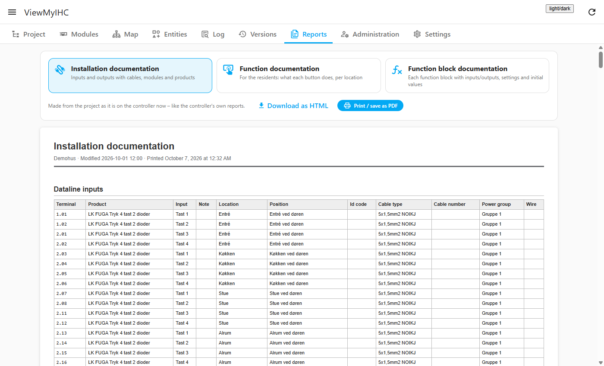

# ViewMyIHC

[](https://hacs.xyz/docs/faq/custom_repositories)
[](https://github.com/knsjensen/ViewMyIHC/actions/workflows/ci.yml)
[](https://github.com/knsjensen/ViewMyIHC/releases)

**Your LK IHC installation, opened up inside Home Assistant.**

If you live in a house with LK IHC Control, you probably know the situation: the project sits in IHC Visual on an old
laptop, ServiceView is a Java program that hardly starts any more, and nobody quite remembers which wire goes to which
terminal. ViewMyIHC brings all of it into a panel in Home Assistant – the whole project, live values, the wiring, the
controller's settings and logs, backups and documentation – on your computer, tablet or phone.

It builds on Home Assistant's own [`ihc` integration](https://www.home-assistant.io/integrations/ihc/) and borrows the
connection it has already made, so ViewMyIHC never asks for or stores the controller's user name and password.

> [!WARNING]
> **Use at your own risk.** ViewMyIHC is a free hobby project without any warranty, and some of its functions change
> your controller. Nobody can be held liable for anything lost or damaged, and no compensation can be claimed. Take your
> own backup before you use it. Read the full [disclaimer](#disclaimer).

> 🇩🇰 **Dansk:** se [afsnittet på dansk](#dansk) nederst.


## What you can do with it

The panel has a tab for each job. Everything is read from the controller itself, and nothing on the controller changes
unless you ask for it.

### Project – see and control everything

The whole IHC project as a tree per room or location: products, function blocks and their inputs, outputs and settings.
The controller's internal helpers are left out, so you see what was actually built. Switch between *All*, *Installation*
and *Programs*, or search by name or resource id.

Pick a resource and you get its live value, what it is linked to, and its id with one click to copy (the number the
`ihc` setup needs). You can **control** it right there – on/off, numbers, temperatures, timers, times and choices – with
the types and limits the controller itself reports. Like the space bar in IHC ServiceView you can **hold** a button
to keep an input active, and you can change the **initial value** the controller starts with after a restart. For push
buttons there is a ready-to-paste automation for **short, long and double press**.

### Modules – the datalines as they really are

Every dataline with the module that was entered for it in IHC Visual (type and panel), showing only the terminals that
module really has – a 230 V input module has 8 inputs even though its line has 16 addresses. Terminals are numbered
like on the module itself (`.01–.08`, `.11–.18`). Click a terminal to see and control what is connected to it. The
last known state is shown at once while the controller is read in the background.

### Map – follow the wires

The installation drawn as a wiring diagram: the controller in the middle with all its connectors (8 input lines, 16
output lines, free ones too), the modules beside it, and a wire from the exact terminal out to each product, with LK's
own product pictures. Wires get the **colour entered in IHC Visual** ("Ledningsfarve"); two-coloured wires are drawn
striped. Tap a wire and it lights up all the way from the product through the terminal and module to the controller,
with its colour, cable type and cable number. Tap a product to see all its terminals with live values. Zoom with the
mouse wheel, pinch or buttons, drag to move, and search for products.


### Entities – connect resources to Home Assistant

All entities of the `ihc` integration, plus entries in your YAML that are waiting for a restart. **Create entity**
writes the YAML for the `ihc` setup and tells you *exactly* where it goes, also when your configuration is split over
several files, and checks that the entry does not exist already. ViewMyIHC never changes your files and never reads
`secrets.yaml`. **Coverage** shows which resources have no entity yet, and which are not linked to anything in the
project.

### Log – what happened

The controller's own log, with batteries, logins and errors highlighted, the SMS and e-mail messages it has sent, and
control by e-mail/SMS. Logs can be emptied (password needed). The **live monitor** shows every value change as it
happens, with a filter and CSV export; it listens along with the `ihc` integration, so your entities are not affected.

### Versions – a backup every time something changes

A copy of the IHC project is kept every time it changes on the controller (the latest 30), and the same goes for the
IHC SceneDesign project (scenes, messages and control by e-mail/SMS). Download any copy – as `.vis` for IHC Visual or
`.icz` for SceneDesign – and see exactly what was added, removed or changed between two versions. A saved version can be
**restored** on the controller (password and confirmation needed; the current version is kept first). Restoring an IHC
project restarts the controller's program, so outputs and counters start again from their initial values.

### Reports – documentation for the house

The three reports from the controller's own report pages – installation documentation, function documentation for the
people living in the house, and function block documentation – ready to print, save as PDF or download as HTML.

### Administration – the controller's settings

Users, time and daylight saving, network, DNS, web access, e-mail (SMTP), e-mail control, SMS modem and system
information. It is shown at once from the last known state while the controller is read in the background, and changes
since last time are marked.

You can change the settings like in IHC Administrator. **Every change needs the password of the IHC user Home Assistant
is logged in with**, only the fields you change are sent, new user passwords are checked and must be typed twice, and
the settings Home Assistant itself depends on (its own user, its access) are protected.

The card *Messages and control* shows who gets an SMS or e-mail when something happens, and who may control the house by
e-mail or SMS, as set up in IHC SceneDesign – with names and phone numbers. These messages and commands can be
**added, changed or removed** from here once a test upload has succeeded on your controller. Every save needs the
password, the current SceneDesign project is kept under Versions first, and what was sent is read back and checked; if
something goes wrong, the previous one is sent back.


### Settings

An optional time limit on the `ihc` integration's connection. Without it the integration can get stuck when the
controller restarts: commands still work, but states stop updating until Home Assistant is restarted. The *About* card
shows the version and the disclaimer.

Light and dark theme, works on phones, in Danish and English (following your Home Assistant profile).

<p>
  
  
</p>

## What ViewMyIHC writes to the controller

Reading is the default. The controller is only changed when you ask for it, and every change has its safeguards:

| What | Where | Safeguards |
|---|---|---|
| Runtime value, hold to change | Project, Modules | Types and limits from the controller; a hold is released if the panel loses its connection, and lasts at most a minute |
| Initial value | Project | Asks for confirmation |
| Users, network, DNS, web access, time, e-mail | Administration | Password of the `ihc` user for every change; changes that can cut the connection need an extra confirmation; Home Assistant's own user and its access cannot be removed |
| Messages and control by e-mail/SMS (SceneDesign) | Administration | A test upload must succeed first; password for every save; the current project is kept first; the upload is read back and checked, and the previous one is sent back if it fails |
| Emptying a log | Log | Password of the `ihc` user |
| Restoring a saved project | Versions | Password of the `ihc` user and an explicit confirmation; the current project is saved first; the controller must report ready afterwards |

These safeguards lower the risk; they do not remove it. See the [disclaimer](#disclaimer).

## Disclaimer

ViewMyIHC is a free, private hobby project. It is not made, supported or endorsed by LK, Schneider Electric or anyone
else, and "LK" and "IHC" are names of their respective owners.

ViewMyIHC is provided "as is", **without any warranty** of any kind (see the [MIT license](LICENSE)). Several of its
functions change the IHC controller: values, initial values, users, network and web access, e-mail and SMS setup, the
SceneDesign project and restoring a whole project. A mistake, an unexpected answer from the controller, a power cut or
a network failure in the middle of a change can leave the controller, the installation or the house not working as
before.

**You use ViewMyIHC entirely at your own risk.** The authors and contributors cannot be held liable for any loss or
damage of any kind – to the controller, the installation, the house, data or anything else – and no compensation can be
claimed for anything that is lost, damaged or stops working by using ViewMyIHC.

**It is your own responsibility** to make and keep your own backup before you use ViewMyIHC: the IHC project from
IHC Visual, the SceneDesign project, and a note of the controller's settings (users, network, e-mail). The copies under
*Versions* are a help, not a replacement for your own backup.

When you add the integration in Home Assistant you are asked to accept this.

## Requirements

- Home Assistant **2026.9** or newer.
- The built-in **`ihc` integration** set up in `configuration.yaml` and connected to your controller.
- The panel is only shown to Home Assistant administrators.

## Installation

Before you start: take your own backup of the IHC project and the SceneDesign project (see the [disclaimer](#disclaimer)).

### With HACS (recommended)

1. In Home Assistant open **HACS**, use the menu (⋮) in the top right corner and choose **Custom repositories**.
2. Enter `https://github.com/knsjensen/ViewMyIHC`, choose the type **Integration** and press **Add**.
3. Search for **ViewMyIHC** in HACS, open it and press **Download**.
4. **Restart Home Assistant.**
5. Go to **Settings → Devices & services → Add integration** and choose **ViewMyIHC**.
6. Read the disclaimer, tick that you accept it, and press **Submit**.
7. *ViewMyIHC* appears in the sidebar.

Updates show up in HACS like for any other integration. After an update, restart Home Assistant – the panel tells you
if the browser and Home Assistant run different versions.

### Manually

Copy `custom_components/viewmyihc` from the [latest release](https://github.com/knsjensen/ViewMyIHC/releases) into
`config/custom_components/`, restart Home Assistant and add the integration as in steps 5–6 above.

## Privacy

ViewMyIHC talks only to your own controller and to Home Assistant. The project copies under *Versions*
(`.storage/viewmyihc_backups`) hold the whole project – including customer data, the SMS phone numbers and the SIM
card's PIN code – exactly like the project file on the controller. They never leave your Home Assistant.

## Development

```bash
python -m venv .venv
.venv/bin/python -m pip install -r requirements-dev.txt     # Windows: .venv\Scripts\python
.venv/bin/python -m pytest
```

The panel runs without Home Assistant against a project file or an invented installation (values are made up; no
controller is contacted):

```bash
python scripts/dev_server.py --demo                # an invented house at a realistic scale
python scripts/dev_server.py path/to/project.vis   # your own project file
```

Then open <http://127.0.0.1:8765/> (`?lang=en` for English). Real `.vis` files contain customer data and are kept out of
the repository by `.gitignore`.

Releases are made by the *Release* workflow: it checks that the version in `manifest.json` matches the tag and attaches
`viewmyihc.zip`, which HACS installs.

The logo is in `custom_components/viewmyihc/brand/`; its SVG source is `assets/brand/icon.svg`.

Inspired by [haihcviewer](https://github.com/dingusdk/haihcviewer).

## License

[MIT](LICENSE) – free to use, change and share, without any warranty.

---

## Dansk

**Dit LK IHC-anlæg, åbnet op i Home Assistant.**

Bor du i et hus med LK IHC Control, kender du det nok: projektet ligger i IHC Visual på en gammel bærbar, ServiceView er
et Java-program, der knap vil starte længere, og ingen kan helt huske, hvilken ledning der går til hvilken klemme.
ViewMyIHC samler det hele i et panel i Home Assistant – hele projektet, levende værdier, ledningsføringen, controllerens
indstillinger og logge, backup og dokumentation – på computer, tablet eller telefon.

Det bygger på Home Assistants egen `ihc`-integration og låner den forbindelse, den allerede har, så ViewMyIHC hverken
spørger efter eller gemmer controllerens brugernavn og adgangskode.

### Ansvarsfraskrivelse

ViewMyIHC er et gratis, privat hobbyprojekt. Det er ikke lavet, understøttet eller godkendt af LK, Schneider Electric
eller andre.

ViewMyIHC leveres, som det er, **uden nogen form for garanti** (se [MIT-licensen](LICENSE)). Flere funktioner ændrer
IHC-controlleren: værdier, startværdier, brugere, netværk og webadgang, e-mail- og SMS-opsætning, SceneDesign-projektet
og genindlæsning af et helt projekt. En fejl, et uventet svar fra controlleren, strømsvigt eller netværksfejl midt i en
ændring kan betyde, at controlleren, installationen eller huset ikke virker som før.

**Du bruger ViewMyIHC helt på eget ansvar.** Udviklerne kan ikke holdes ansvarlige for tab eller skader af nogen art – på
controlleren, installationen, huset, data eller andet – og der kan ikke kræves erstatning for noget, der går tabt,
bliver ødelagt eller holder op med at virke ved brug af ViewMyIHC.

**Det er dit eget ansvar** at tage og gemme din egen backup, før du bruger ViewMyIHC: IHC-projektet fra IHC Visual,
SceneDesign-projektet og en note om controllerens indstillinger (brugere, netværk, e-mail). Kopierne under *Versioner*
er en hjælp, ikke en erstatning for din egen backup.

Når du tilføjer integrationen i Home Assistant, bliver du bedt om at acceptere dette.

### Hvad kan den?

- **Projekt:** hele IHC-projektet som et træ pr. rum med levende værdier. Du kan styre enhver ressource, holde en
  knap inde som mellemrumstasten i ServiceView, ændre startværdien og få en færdig automation til kort, langt og
  dobbelt tryk.
- **Moduler:** alle datalinjer med det modul, der er angivet i IHC Visual, og kun de klemmer modulet faktisk har,
  nummereret som på modulet (`.01–.08`, `.11–.18`).
- **Kort:** anlægget som ledningsdiagram med controlleren i midten, alle dens 8 indgangs- og 16 udgangslinjer (også de
  ledige), modulerne og produkterne med LK's egne billeder. Ledningerne får den ledningsfarve, der er skrevet i IHC
  Visual, og trykker du på en ledning, lyser den op hele vejen fra produktet til controlleren.
- **Entiteter:** alle `ihc`-entiteter, en YAML-generator der fortæller præcis hvor linjerne skal stå, og en oversigt
  over ressourcer uden entitet.
- **Log:** controllerens egen log, sendte SMS'er og e-mails, styring via e-mail/SMS og en live-monitor over alle
  ændringer.
- **Versioner:** en kopi af IHC- og SceneDesign-projektet, hver gang det ændres, med forskelle mellem versioner, download
  og genindlæsning.
- **Rapporter:** installationsdokumentation, funktionsbeskrivelse til beboerne og funktionsblokke – klar til print eller
  PDF.
- **Administration:** brugere, tid, netværk, DNS, webadgang, e-mail, SMS-modem og systeminfo – og hvem der får besked,
  og hvem der må styre huset via e-mail/SMS. Alt kan rettes, og hver ændring kræver adgangskoden for den IHC-bruger, Home
  Assistant er logget ind med.
- **Indstillinger:** en valgfri tidsgrænse på `ihc`-forbindelsen, så integrationen ikke hænger efter en genstart af
  controlleren.

Panelet findes på dansk og engelsk og følger sproget i din Home Assistant-profil.

### Installation med HACS

Inden du går i gang: tag din egen backup af IHC-projektet og SceneDesign-projektet.

1. Åbn **HACS**, tryk på menuen (⋮) øverst til højre, og vælg **Brugerdefinerede repositories**.
2. Indsæt `https://github.com/knsjensen/ViewMyIHC`, vælg typen **Integration**, og tryk **Tilføj**.
3. Søg efter **ViewMyIHC** i HACS, åbn den, og tryk **Download**.
4. **Genstart Home Assistant.**
5. Gå til **Indstillinger → Enheder og tjenester → Tilføj integration**, og vælg **ViewMyIHC**.
6. Læs ansvarsfraskrivelsen, sæt flueben ved at du accepterer den, og tryk **Send**.
7. *ViewMyIHC* dukker op i sidebjælken (kun for administratorer).

Kræver Home Assistant 2026.9 eller nyere og den indbyggede `ihc`-integration sat op i `configuration.yaml`.
