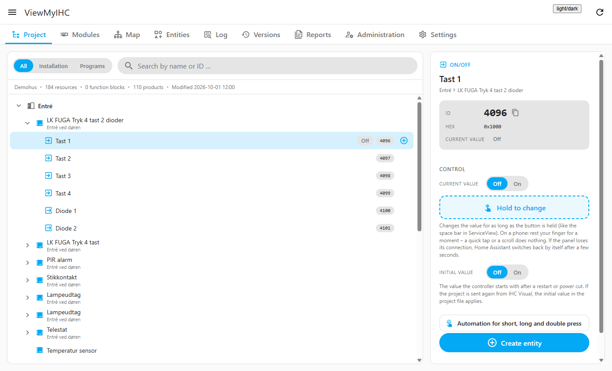
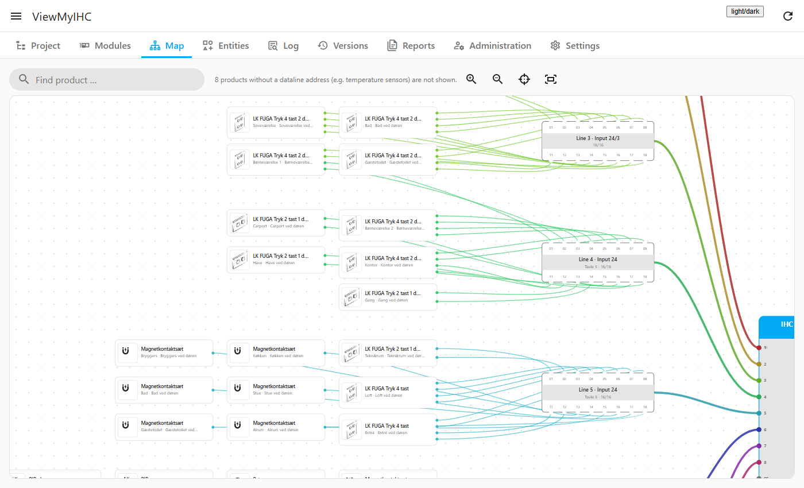
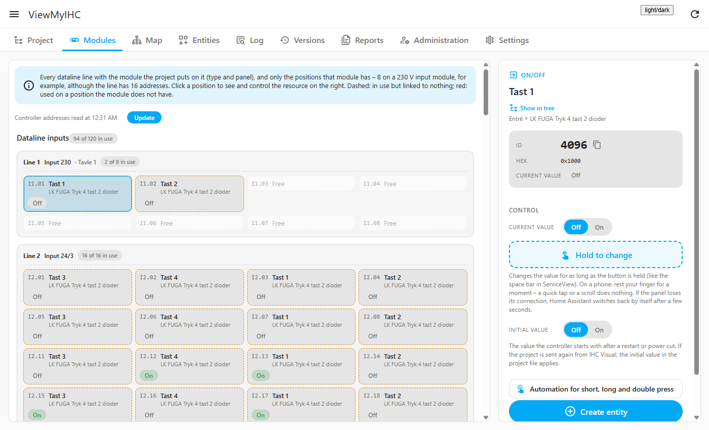
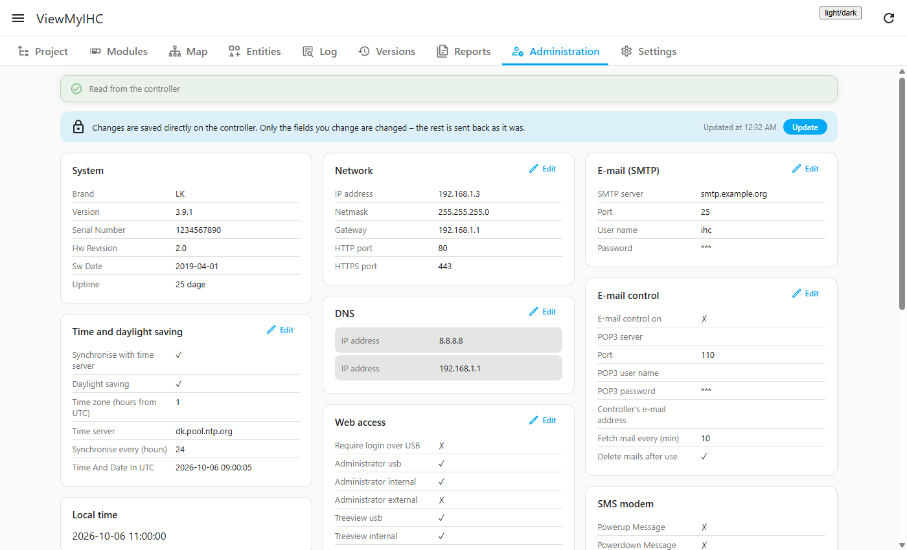

# ViewMyIHC

[](https://hacs.xyz/docs/faq/custom_repositories)
[](https://github.com/knsjensen/ViewMyIHC/actions/workflows/ci.yml)
[](https://github.com/knsjensen/ViewMyIHC/releases)

A Home Assistant panel for **LK IHC Control** (Schneider Electric) controllers. It shows your whole IHC project, lets you
watch and control every resource, draws the wiring of your installation, and gives you the controller's administration,
logs and documentation – all inside Home Assistant.

ViewMyIHC is an *extension* of Home Assistant's built-in [`ihc` integration](https://www.home-assistant.io/integrations/ihc/):
it uses the connection `ihc` has already made, so it never needs or stores your controller's user name or password.

> 🇩🇰 **Dansk:** se [afsnittet på dansk](#dansk) nederst.



## Features

**Project**
- The whole IHC project as a tree per location: products, function blocks and their inputs, outputs and settings
  (internal settings and programs are left out). Switch between *All*, *Installation* and *Programs*; search by name or id.
- The IHC resource id (the number the `ihc` setup uses) with one click to copy, links between resources, and live values.
- **Control** any resource: set its value (on/off, numbers, °C, timer, time, choices), **hold to change** like the space
  bar in IHC ServiceView, and set the **initial value** the controller starts with. Types and limits come from the
  controller itself.
- An automation for **short, long and double press** of a push button, ready to paste.

**Modules and map**
- **Modules:** every dataline with the module entered in IHC Visual (type and panel) and only the positions that module
  has – 8 on a 230 V input module although its line has 16 addresses. Terminals are numbered like on the module
  (`.01–.08`, `.11–.18`). Click a position to see and control it.
- **Map:** the installation as a wiring diagram – the controller in the middle, input modules to the left, output modules
  to the right, and a wire from the very terminal a product is connected to out to the product, with LK's own product
  pictures. Wires get the colour entered in IHC Visual ("Ledningsfarve"), and every connector of the controller is
  shown, the free ones too. Zoom with wheel, pinch or buttons, drag to move, search, tap a product to see its terminals
  with live values, or tap a wire to follow it all the way from the product to the controller.



**Entities**
- Every entity of the `ihc` integration, plus entries in your YAML that wait for a restart.
- **Create entity:** a YAML generator for the `ihc` setup that tells you *exactly* where the entry goes (also when your
  setup is split over several files) and checks that it does not exist already. ViewMyIHC never changes your files and
  never reads `secrets.yaml`.
- **Coverage:** which resources have no entity yet, and which are linked to nothing in the project.

**Log**
- The controller's own log (batteries, logins and errors highlighted), sent SMS/e-mail messages and control by
  e-mail/SMS. Logs can be emptied (password needed).
- A **live monitor** of every value change, with filter and CSV export. It listens to the `ihc` integration's own
  notifications, so it takes nothing away from your entities.

**Versions and reports**
- A copy of the project is kept every time it changes on the controller (the latest 30). Download any copy as a `.vis`
  file for IHC Visual and see what was added, removed or changed between two versions. The IHC SceneDesign project
  (scenes, messages, control by e-mail/SMS) is kept the same way and can be downloaded as `.icz`.
- **Restore** any saved version on the controller (password and confirmation needed; the current version is kept first).
  Restoring an IHC project restarts the controller's program, so outputs and counters start again from their initial
  values.
- The three reports of the controller's own report pages – installation documentation, function documentation for the
  residents and function block documentation – to print, save as PDF or download as HTML.

**Administration**
- Users, time and daylight saving, network, DNS, web access, e-mail (SMTP), e-mail control, SMS modem and system info,
  shown at once from the last saved state while the controller is read in the background; changes are marked.
- Who gets an SMS or e-mail when a resource changes, and who may control the controller by e-mail/SMS, as set up in
  IHC SceneDesign (shown with names and phone numbers). These messages and commands can be added, changed or removed
  from here once a test upload has succeeded on your controller; every save needs the password, the current SceneDesign
  project is kept under Versions first, and what was sent is read back and checked (the old one is sent back if not).
- Change them like in IHC Administrator. **Every change needs the password of the user Home Assistant is logged in
  with**, only the fields you change are sent, and the settings Home Assistant itself depends on are protected.

**Settings**
- An optional time limit on the `ihc` integration's connection. Without it the integration can get stuck when the
  controller restarts: commands still work but states stop updating until Home Assistant restarts.

Light and dark theme, works on phones, Danish and English.

<p>
  
  
</p>

## Requirements

- Home Assistant **2026.9** or newer.
- The built-in **`ihc` integration** set up in `configuration.yaml` and connected to your controller.
- The panel is only shown to Home Assistant administrators.

## Installation

### With HACS (recommended)

1. In Home Assistant open **HACS**, use the menu (⋮) in the top right corner and choose **Custom repositories**.
2. Enter `https://github.com/knsjensen/ViewMyIHC`, choose the type **Integration** and press **Add**.
3. Search for **ViewMyIHC** in HACS, open it and press **Download**.
4. **Restart Home Assistant.**
5. Go to **Settings → Devices & services → Add integration** and choose **ViewMyIHC**.
6. *ViewMyIHC* appears in the sidebar.

Updates show up in HACS like for any other integration. After an update, restart Home Assistant – the panel warns you
if the browser and Home Assistant run different versions.

### Manually

Copy `custom_components/viewmyihc` from the [latest release](https://github.com/knsjensen/ViewMyIHC/releases) into
`config/custom_components/`, restart Home Assistant and add the integration as in step 5 above.

## What ViewMyIHC writes to the controller

Reading is the default. The controller is only changed when you ask for it:

| What | Where | Safeguards |
|---|---|---|
| Runtime value, hold to change | Detail panel | Types and limits from the controller; a hold is released by Home Assistant if the panel loses its connection, and lasts at most a minute |
| Initial value | Detail panel | Asks for confirmation |
| Users, network, DNS, web access, time, e-mail | Administration | Password of the `ihc` user for every change; changes that can cut the connection need an extra confirmation; Home Assistant's own user and its access cannot be removed |
| Emptying a log | Log | Password of the `ihc` user |
| Restoring a saved project | Versions | Password of the `ihc` user and an explicit confirmation; the current project is saved first; project change mode is always left again and the controller must report ready |

**Privacy:** the project copies under *Versions* (`.storage/viewmyihc_backups`) hold the whole project – including
customer data, the SMS phone numbers and the SIM card's PIN code – exactly like the project file on the controller.
They never leave your Home Assistant.

## Development

```bash
python -m venv .venv
.venv/bin/python -m pip install -r requirements-dev.txt     # Windows: .venv\Scripts\python
.venv/bin/python -m pytest
```

The panel runs without Home Assistant against a project file or an invented installation (values are made up; no
controller is contacted):

```bash
python scripts/dev_server.py --demo                # an invented house at a realistic scale
python scripts/dev_server.py path/to/project.vis   # your own project file
```

Then open <http://127.0.0.1:8765/> (`?lang=en` for English). Real `.vis` files contain customer data and are kept out of
the repository by `.gitignore`.

Releases are made by the *Release* workflow: it checks that the version in `manifest.json` matches the tag and attaches
`viewmyihc.zip`, which HACS installs.

The logo is in `custom_components/viewmyihc/brand/`; its SVG source is `assets/brand/icon.svg`.

Inspired by [haihcviewer](https://github.com/dingusdk/haihcviewer).

## License

[MIT](LICENSE)

---

## Dansk

ViewMyIHC er et panel i Home Assistant til **LK IHC Control**. Det viser hele dit IHC-projekt, lader dig følge og styre
alle ressourcer, tegner ledningsplanen for dit anlæg og giver dig controllerens administration, logge og dokumentation –
direkte i Home Assistant. Det bygger på den indbyggede `ihc`-integration og bruger dens forbindelse, så ViewMyIHC kender
aldrig dit brugernavn eller din adgangskode.

**Installation med HACS**

1. Åbn **HACS**, tryk på menuen (⋮) øverst til højre, og vælg **Brugerdefinerede repositories**.
2. Indsæt `https://github.com/knsjensen/ViewMyIHC`, vælg typen **Integration**, og tryk **Tilføj**.
3. Søg efter **ViewMyIHC** i HACS, åbn den, og tryk **Download**.
4. **Genstart Home Assistant.**
5. Gå til **Indstillinger → Enheder og tjenester → Tilføj integration**, og vælg **ViewMyIHC**.
6. *ViewMyIHC* dukker op i sidebjælken (kun for administratorer).

Kræver Home Assistant 2026.9 eller nyere og den indbyggede `ihc`-integration sat op i `configuration.yaml`.

Panelet findes på dansk og engelsk og følger sproget i din Home Assistant-profil. Alt, der ændrer controllerens
opsætning (brugere, netværk, webadgang m.m.), kræver adgangskoden for den bruger, Home Assistant er logget ind på IHC med.
